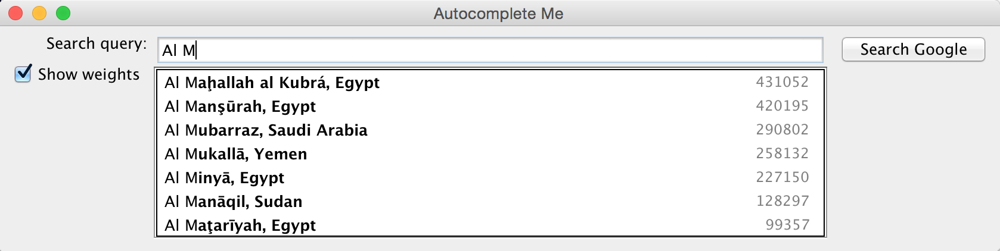

# Projeto Final: Recurso de autocompletar

Escreva um programa para implementar o preenchimento automático (também conhecido como _autocomplete_) para um determinado conjunto de $N$ termos, onde um termo é representado por uma _string_ e um peso não negativo associado. Ou seja, dado um prefixo, encontre todas os termos que começam com o prefixo fornecido, em ordem decrescente de peso.

A função de auto-completar é extremamente comum em aplicações modernas. À medida que o usuário digita, o programa prevê a consulta completa (normalmente uma palavra ou frase) que o usuário pretende digitar. O preenchimento automático é mais eficaz quando há um número limitado de consultas prováveis. Por exemplo, o [Internet Movie Database](https://www.imdb.com/) o utiliza para exibir os nomes dos filmes conforme o usuário digita; os mecanismos de pesquisa o utilizam para exibir sugestões conforme o usuário insere consultas de pesquisa na _web_; os telefones celulares o utilizam para agilizar o processo de entrada de texto.

Veja abaixo os exemplos citados:


Nestes exemplos, a aplicação prevê a probabilidade de o usuário digitar cada consulta e apresenta ao usuário uma lista das principais consultas correspondentes, em ordem decrescente de peso. Esses pesos são determinados por dados históricos, como receitas de bilheteria de filmes, frequências de consultas de pesquisa de outros usuários do Google ou histórico de digitação de um usuário de telefone celular. Para efeitos desta atribuição, você terá acesso a um conjunto de todas as termos possíveis e pesos associados (e essas consultas e pesos não serão alterados).

O desempenho da funcionalidade de preenchimento automático é fundamental em muitos sistemas. Por exemplo, considere um mecanismo de pesquisa que executa um aplicativo de preenchimento automático em um _datacenter_. Para que o usuário tenha uma boa experiência ao usar a aplicação, ela deve retornar as sugestões em cerca de 50ms! Além disso, em princípio, essa função deve realizar esse cálculo para cada pressionamento de tecla digitado na barra de pesquisa e para cada usuário!

Nesta tarefa, você implementará o preenchimento automático ordenando todos os termos possíveis de consulta; irá utilizar pesquisa binária para encontrar todas as correspondências que começam com um determinado prefixo; e por fim ordenando os termos correspondentes por peso.

## Parte 1: Criação de um tipo abstrado de dados: `ListaOrdenada<T>`

Defina uma classe chamada `Lista` que representa uma lista genérica de itens de qualquer tipo. Para proporcionar a generalização, utilize _template_ de classes. Implemente métodos para inserção, para retornar o tamanho e para imprimir a lista na tela. Sobrecarregue o operador de acesso a um valor da lista (`[]`).

Defina uma classe chamada `ListaOrdenada` que herda de `Lista`. Implemente métodos para ordenação da lista: um para ordenar utilizando a STL (lembra da biblioteca `<algorithm>` e a função `sort`?) e outro para ordenar baseado em uma [função de comparação](#função-de-comparação) entre dois valores passados como parâmetro.

### Função de comparação

Uma função de comparação é utilizada para proporcionar a capacidade de ordenação de uma lista de objetos (que por sua vez podem ser ordenados baseado em diferentes atributos). Uma função de comparação recebe dois parâmetros: se o primeiro e o segundo parâmetro estão na ordem correta de ordenação, retorna `1`; se estão em posição trocada, retorna `-1`; se são iguais, retorna `0`;

Exemplo de uma função de comparação para proporcionar a ordenação de um _container_ com elementos do tipo `Pessoa` a partir de seu atributo `idade`:

```c++
int Pessoa::compararPelaIdade(Pessoa P1, Pessoa P2) {
	if (P1.idade > P2.idade) {
		return 1;
	} else if (P1.idade == P2.idade) {
		return 0;
	} else {
		return -1;
	}
}
```

## Parte 2: Criação da classe `Termo`

Defina uma classe chamada `Termo` que representa um termo do preenchimento automático. Seus atributos devem ser:

- uma termo (`string`);
- um peso (`int`).

Esta classe deve sobrecarregar o operador de comparação `<` para que seja possível ordenar objetos deste tipo utilizando `std::sort()` da biblioteca padrão. Essa comparação deve ser baseada no atributo `termo`.

Você deve também incluir, além do construtor parametrizado, dois métodos estáticos de comparação de dois objetos `Termo`: um baseado em prefixo de `termo` e outro baseado no `peso`. Esses dois métodos são utilizados como *funções de comparação* que serão passados como argumento do método de ordenação da sua `ListaOrdenada`.

Exemplo de declaração para a classe `Termo` (você não é obrigado a usar essa declaração):

```c++
class Termo {

    private:
        std::string termo;
        long peso;

        public:
        // construtor padrão
        Termo();

        // construtor parametrizado pelo termo e pelo peso
        Termo(std::string termo, long peso);

        // compara os dois termos de forma decrescente pelo peso
        // se a ordem de T1 e T2 estiver de forma decrescente em relação ao peso, retorna 1;
        // se T1 e T2 tiverem o mesmo peso, retorna 0;
        // caso contrário, retorna -1;
        static int compararPeloPeso(Termo T1, Termo T2);

        // compara os dois termos por ordem alfabética, usando somente os r primeiros caracteres
        // se a ordem de T1 e T2 estiver de forma decrescente em relação ao prefixo com r caracteres, retorna 1;
        // se T1 e T2 tiverem o mesmo prefixo com r caracteres, retorna 0;
        // caso contrário, retorna -1;
        static int compararPeloPrefixo(Termo T1, Termo T2, int r);

        // sobrecarrega o operador "<" para a classe Termo
        // T1 < T2 se o termo de T1 é menor que o de T2 (comparação de strings)
        bool operator<(Termo T2);

        // sobrecarrega o operador "<<" para a classe Termo. Note que é um método friend
        friend std::ostream& operator<<(std::ostream &out, const Termo& t);

};
```

## Parte 3: Criação da classe `Autocompletar`

Defina uma classe chamada `Autocompletar` que provê a funcionalidade de preenchimento automático para um conjunto de objetos `Termo`. Para este projeto, utilize o **algoritmo de busca binária** para encontrar com eficiência todos os termos que tem o atributo `termo` iniciando com um determinado prefixo. Em seguida, classifique os termos correspondentes em ordem decrescente por `peso`. 

Para fazer isso, você precisa (1) classificar os termos em ordem alfabética por `termo` e depois (2) usar a busca binária para pesquisar um determinado prefixo, em uma lista ordenada. Lembre que para um determinado prefixo os termos correspondentes podem ser mais de um, e você precisará posteriomente ordena-los por peso.

**Obs: Você deve usar sua própria implementação da busca binária, e não utilizar nenhuma implementação de terceiros.**

## Conjunto de dados para o seu programa

Já são fornecidos vários arquivos de entrada de amostra para testar o seu programa. Cada arquivo consiste em $N$ pares de `strings` de termos e pesos não negativos. Há um par por linha, com o peso e a `string` separados por um `<TAB>`. Um peso pode ser qualquer número inteiro entre $0$ e $2^{63} − 1$. Uma `string` de termo pode ser uma sequência arbitrária de caracteres Unicode, incluindo espaços (mas não novas linhas).

- O arquivo [fortune.txt](datasets/fortune.txt) contém as 1.000 empresas americanas, com pesos proporcionais ao seu faturamento no ano de 2002.

- O arquivo [imdb.txt](datasets/imdb.txt) contém uma lista de 82.455 filmes, com pesos proporcionais a bilheteria arrecadada.

- O arquivo [actors.txt](datasets/actors.txt) contém uma lista de 99.970 atores e atrizes, com pesos proporcionais a popularidade do ator/atriz.

- O arquivo [cities.txt](datasets/cities.txt) contém uma lista de 90.000 cidades do mundo, com pesos proporcionais a população.

## Execução do programa

Quando você executar o seu programa, ele deve receber como parâmetros posicionais o *dataset* desejado e um valor inteiro `k`. Esse valor inteiro limita a quantidade de retorno de termos do seu recurso de autocompletar para `k` termos caso ele retorne um valor maior ou igual a `k`.

Seu programa deve então permitir que o usuário entre com a consulta desejada, e então apertar `<ENTER>` para realizar a etapa de preenchimento automático. O programa deve retornar os `k` termos que casaram com o prefixo informado, ordenado por peso. Ele pode repetir o processo quantas vezes quiser, até que seja enviado a palavra `sair`, que encerra a execução do programa. Veja um exemplo de execução e interação com o programa:

```bash
$ ./bin/autocompletar datasets/actors.txt 10

Entre com o termo a ser auto-completado: (digite "sair" para encerrar o programa): 
Will <ENTER>
2790243210      Will Smith (I)
2739685985      Willem Dafoe
2402502653      William Fichtner
2178370600      Will Ferrell
1737902013      Will Arnett
1674790786      William H. Macy
1589682687      William Melling
1398831928      William Hurt
1172371613      William Shatner
1132672375      William Sadler (I)

Entre com o termo a ser auto-completado: (digite "sair" para encerrar o programa): 
Mary <ENTER>
1811632876      Mary Ellen Trainor
1322246171      Mary Steenburgen
1095979260      Mary Pat Gleason
923434547       Mary Kay Place
805518471       Mary Kay Bergman
751856240       Mary Linda Phillips
666922752       Mary Lynn Rajskub
662564172       Mary Black (I)
655198435       Mary McDonnell (I)
617010839       Mary-Louise Parker

Entre com o termo a ser auto-completado: (digite "sair" para encerrar o programa): 
sair <ENTER>

$ 
```

## Possível fluxo de execução

Abaixo seguem alguns passos de "alto nível" que podem ser usados por você para resolver o problema:

```
[1] Leia a base de dados e armazene as informações nos objetos apropriados (`Termo`)
[2] Instancie seu objeto `Autocompletar` e armazene os objetos gerados na estrutura de dados implemetada (`ListaOrdenada<Termo>`)
[3] Ordene sua estrutura baseado no atributo `termo` de forma alfabética
[2] Permita ao usuário entrar com a consulta desejada
[3] Caso a consulta seja "sair", encerrar o programa
[4] Use busca binária para encontrar os termos que casam com a consulta realizada
[5] Ordene os termos encontrados pelo `peso`
	[5.a] Se uma quantidade menor ou igual a `k` de termos forem encontrados, mostre todos.
    [5.b] Se uma quantidade maior a `k` de termos forem encontrados, mostre os `k` primeiros (com os maiores pesos).
[6] Volte ao passo (2)
```

## Extra (opcional)

Implemente uma GUI (_graphical user interface_) interativa que auto-complete as consultas do usuário em tempo de digitação! É uma ótima oportunidade para aprender sobre interfaces gráficas em C++!

Veja um exemplo para um _dataset_ de cidades do mundo:

